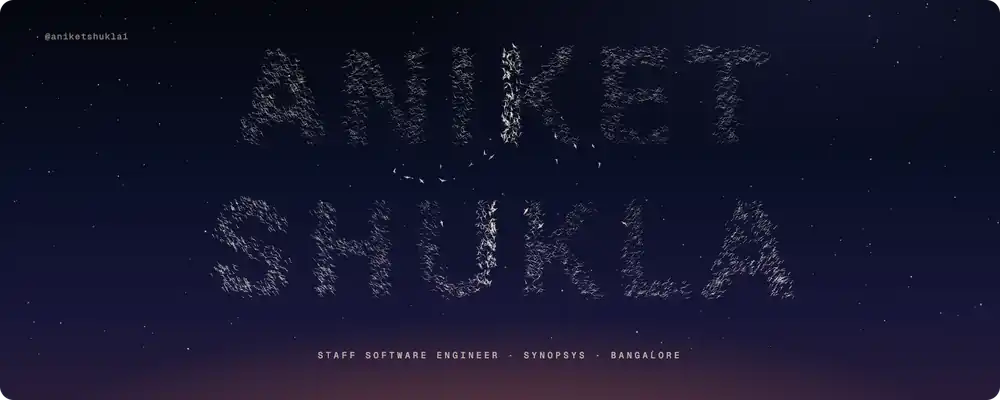
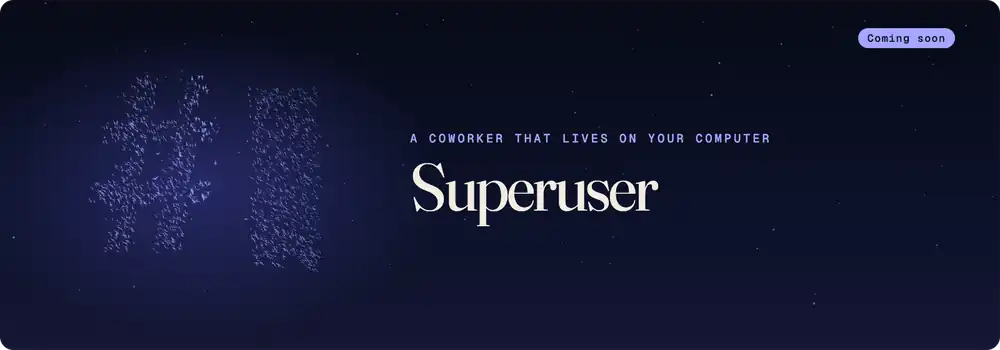
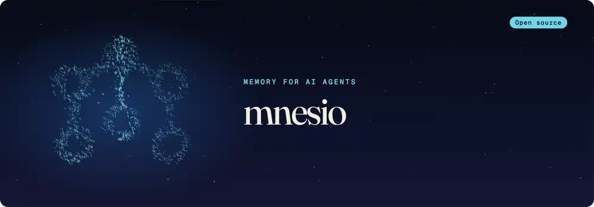
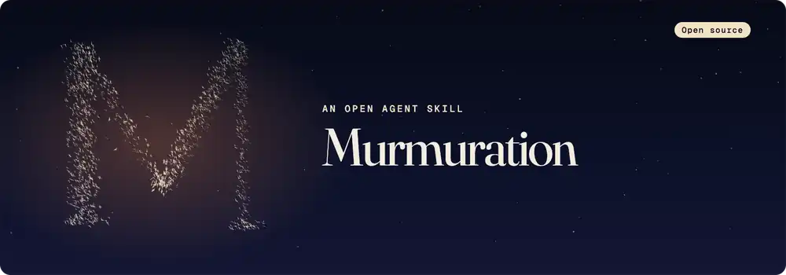
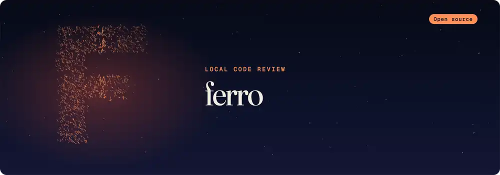

<picture>
  <source media="(prefers-reduced-motion: reduce)" srcset="./art/banner-still.webp" />
  
</picture>

### I build AI tools you can trust.

They run on your machine, ask before they act, and prove what they did.

<a href="https://linkedin.com/in/aniketshukla1">LinkedIn</a> · <a href="https://x.com/aniket_shukla_">X</a> · <a href="https://instagram.com/itsaniketshuklaa">Instagram</a>

 

<picture>
  <source media="(prefers-reduced-motion: reduce)" srcset="./art/superuser-still.webp" />
  
</picture>

The AI you can tell everything. It runs on your machine, asks before it acts, and shows you everything that left. 
<code>macOS</code> · <code>no account</code> · <code>no telemetry</code> · <code>runs with the Wi-Fi off</code> 
Coming soon.

 

<a href="https://github.com/mnesio/mnesio"><picture>
  <source media="(prefers-reduced-motion: reduce)" srcset="./art/mnesio-still.webp" />
  
</picture></a>

Memory that helps AI agents learn from outcomes, and improves their policies through a safety gate. 
<code>Rust core</code> · <code>MCP server</code> · <code>Python + Node SDKs</code> 
<a href="https://github.com/mnesio/mnesio"><strong>Repository ↗</strong></a> · <a href="https://mnesio.github.io/mnesio/"><strong>Documentation ↗</strong></a> · <a href="https://mnesio.github.io/mnesio/start/getting-started/">Get started</a>

 

<a href="https://github.com/aniketshukla1/murmuration"><picture>
  <source media="(prefers-reduced-motion: reduce)" srcset="./art/murmuration-still.webp" />
  
</picture></a>

Websites that move like what they're about. It finds your subject's verb and builds the site with real 3D made in code. 
<code>any agent</code> · <code>HTML, CSS and JS</code> · <code>no build step</code> 
<a href="https://github.com/aniketshukla1/murmuration"><strong>Repository ↗</strong></a> · <a href="https://aniketshukla1.github.io/murmuration/"><strong>Website ↗</strong></a> · <code>npx skills add aniketshukla1/murmuration</code>

 

<a href="https://github.com/aniketshukla1/ferro"><picture>
  <source media="(prefers-reduced-motion: reduce)" srcset="./art/ferro-still.webp" />
  
</picture></a>

Understand your code changes before you push. Diffs, tests and security, reviewed on your own machine. 
<code>Rust core</code> · <code>GitHub + GitLab</code> · <code>runs locally</code> 
<a href="https://github.com/aniketshukla1/ferro"><strong>Repository ↗</strong></a> · <a href="https://aniketshukla1.github.io/ferro/"><strong>Try the live demo ↗</strong></a> · <a href="https://github.com/aniketshukla1/ferro#-quickstart">Quickstart</a>

 

#### Also building

<a href="https://github.com/aniketshukla1/agent-cli"><strong>agent-cli</strong></a>, a fast AI agent for your terminal, in Rust, with MCP and skills · <a href="https://github.com/aniketshukla1/sdlc-workflow"><strong>sdlc-workflow</strong></a>, paste a Jira key and get a merged MR

#### Merged upstream

Into <a href="https://github.com/floci-io/floci">Floci</a>, the free local AWS emulator: 
<code>EC2</code> regional private DNS names (<a href="https://github.com/floci-io/floci/pull/5033">#5033</a>) · <code>CloudFormation</code> stack tags on updates (<a href="https://github.com/floci-io/floci/pull/5031">#5031</a>) · <code>API Gateway</code> method response parameters (<a href="https://github.com/floci-io/floci/pull/5030">#5030</a>)

 

<picture>
  <source media="(prefers-reduced-motion: reduce)" srcset="./contrib-heatmap.svg#static" />
  
</picture>

Every animation on this page is a flock simulated on the GPU, made with <a href="https://github.com/aniketshukla1/murmuration">Murmuration</a>.

