<h3><code>aniket@github ~ $ ./contributions.sh</code></h3>
<picture>
  <source media="(prefers-reduced-motion: reduce)" srcset="./contrib-heatmap.svg#static" />
  
</picture>

<!-- DAILY-COUNTS:START -->

Daily counts — hover a square

<pre>Sun 
Mon 
Tue 
Wed 
Thu 
Fri 
Sat </pre>

595 contributions · 2025-10-05 to 2026-10-06. Click a day to view its activity on GitHub.

<!-- DAILY-COUNTS:END -->

  

<h3><code>aniket@github ~ $ whoami</code></h3>

<table>
  <tr>
    <td valign="top"><picture><source media="(prefers-reduced-motion: reduce)" srcset="./aniket-ascii.svg#static" /></picture></td>
    <td valign="top"><picture><source media="(prefers-reduced-motion: reduce)" srcset="./info-card.svg#static" /></picture></td>
  </tr>
</table>

 

<h3><code>aniket@github ~ $ ls ~/projects</code></h3>

<a href="https://github.com/mnesio/mnesio">
  <picture>
    <source media="(prefers-reduced-motion: reduce)" srcset="./mnesio-card.svg#static" />
    
  </picture>
</a>

  

<a href="https://github.com/aniketshukla1/ferro">
  <picture>
    <source media="(prefers-reduced-motion: reduce)" srcset="./ferro-card.svg#static" />
    
  </picture>
</a>

 

<h3><code>aniket@github ~ $ ./links.sh</code></h3>

<a href="https://github.com/mnesio/mnesio">mnesio</a> · <a href="https://github.com/aniketshukla1/ferro">ferro</a> · <a href="https://github.com/aniketshukla1?tab=repositories">Projects</a> · <a href="https://x.com/aniket_shukla_">X</a> · <a href="https://instagram.com/itsaniketshuklaa">Instagram</a>

Staff Software Engineer · Full-Stack Development · Scalable Systems

