<h3><code>aniket@github ~ $ whoami</code></h3>

<strong>Building memory for AI agents and tools for developers.</strong>

<picture>
  <source media="(max-width: 600px) and (prefers-reduced-motion: reduce)" srcset="./whoami-mobile.svg#static" />
  <source media="(max-width: 600px)" srcset="./whoami-mobile.svg" />
  <source media="(prefers-reduced-motion: reduce)" srcset="./whoami.svg#static" />
  
</picture>

<a href="https://github.com/mnesio/mnesio">mnesio</a> · <a href="https://github.com/aniketshukla1/ferro">ferro</a> · <a href="https://linkedin.com/in/aniketshukla1">LinkedIn</a>

 

<h3><code>aniket@github ~ $ ls ~/projects</code></h3>

<a href="https://github.com/mnesio/mnesio">
  <picture>
    <source media="(max-width: 600px) and (prefers-reduced-motion: reduce)" srcset="./mnesio-mobile.svg#static" />
    <source media="(max-width: 600px)" srcset="./mnesio-mobile.svg" />
    <source media="(prefers-reduced-motion: reduce)" srcset="./mnesio-card.svg#static" />
    
  </picture>
</a>

<a href="https://github.com/mnesio/mnesio"><strong>Repository ↗</strong></a> · <a href="https://mnesio.github.io/mnesio/"><strong>Documentation ↗</strong></a> · <a href="https://mnesio.github.io/mnesio/start/getting-started/">Get started</a>

 

<a href="https://github.com/aniketshukla1/ferro">
  <picture>
    <source media="(max-width: 600px) and (prefers-reduced-motion: reduce)" srcset="./ferro-mobile.svg#static" />
    <source media="(max-width: 600px)" srcset="./ferro-mobile.svg" />
    <source media="(prefers-reduced-motion: reduce)" srcset="./ferro-card.svg#static" />
    
  </picture>
</a>

<a href="https://github.com/aniketshukla1/ferro"><strong>Repository ↗</strong></a> · <a href="https://aniketshukla1.github.io/ferro/"><strong>Try the live demo ↗</strong></a> · <a href="https://github.com/aniketshukla1/ferro#-quickstart">Quickstart</a>

 

<h3><code>aniket@github ~ $ git log --oneline</code></h3>

Selected merged contributions to <a href="https://github.com/floci-io/floci">Floci</a>.

- <code>EC2</code> Use regional private DNS names. <a href="https://github.com/floci-io/floci/pull/5033">Merged #5033 ↗</a>
- <code>CloudFormation</code> Apply stack tags during updates. <a href="https://github.com/floci-io/floci/pull/5031">Merged #5031 ↗</a>
- <code>API Gateway</code> Preserve and update method response parameters. <a href="https://github.com/floci-io/floci/pull/5030">Merged #5030 ↗</a>

 

<h3><code>aniket@github ~ $ ./contributions.sh</code></h3>

<picture>
  <source media="(prefers-reduced-motion: reduce)" srcset="./contrib-heatmap.svg#static" />
  
</picture>

 

<h3><code>aniket@github ~ $ ./links.sh</code></h3>

<a href="https://linkedin.com/in/aniketshukla1">LinkedIn</a> · <a href="https://github.com/aniketshukla1?tab=repositories">All projects</a> · <a href="https://x.com/aniket_shukla_">X</a> · <a href="https://instagram.com/itsaniketshuklaa">Instagram</a>

Staff Software Engineer · AI Memory · Developer Tools · Scalable Systems

